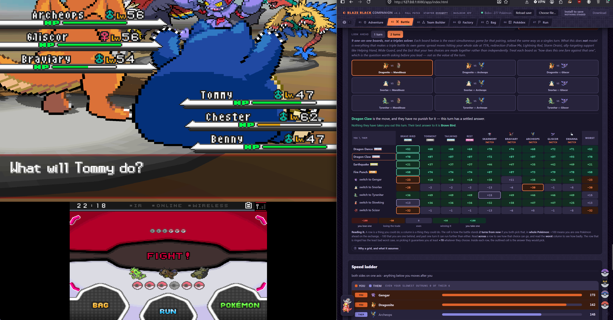
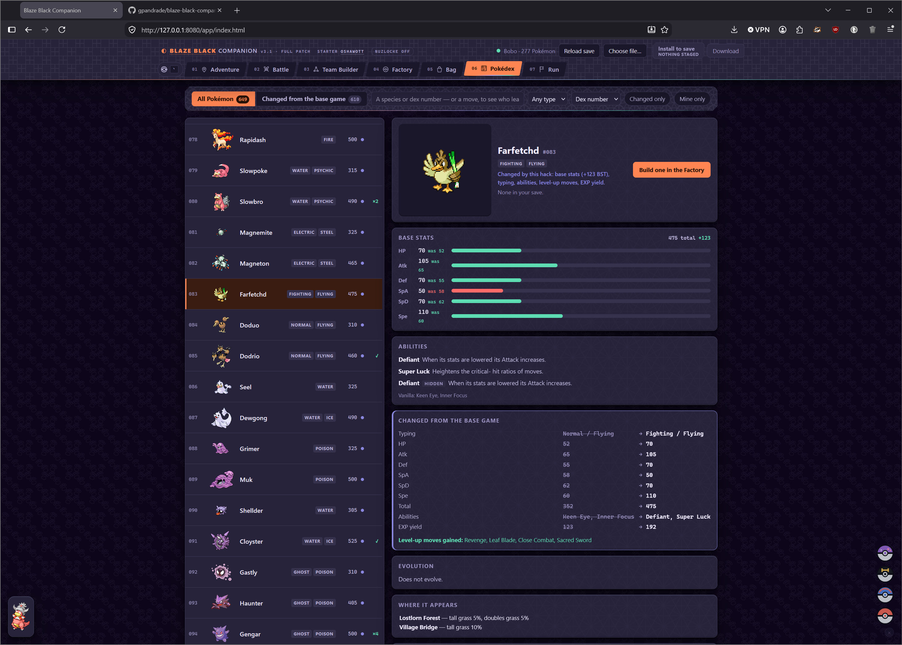
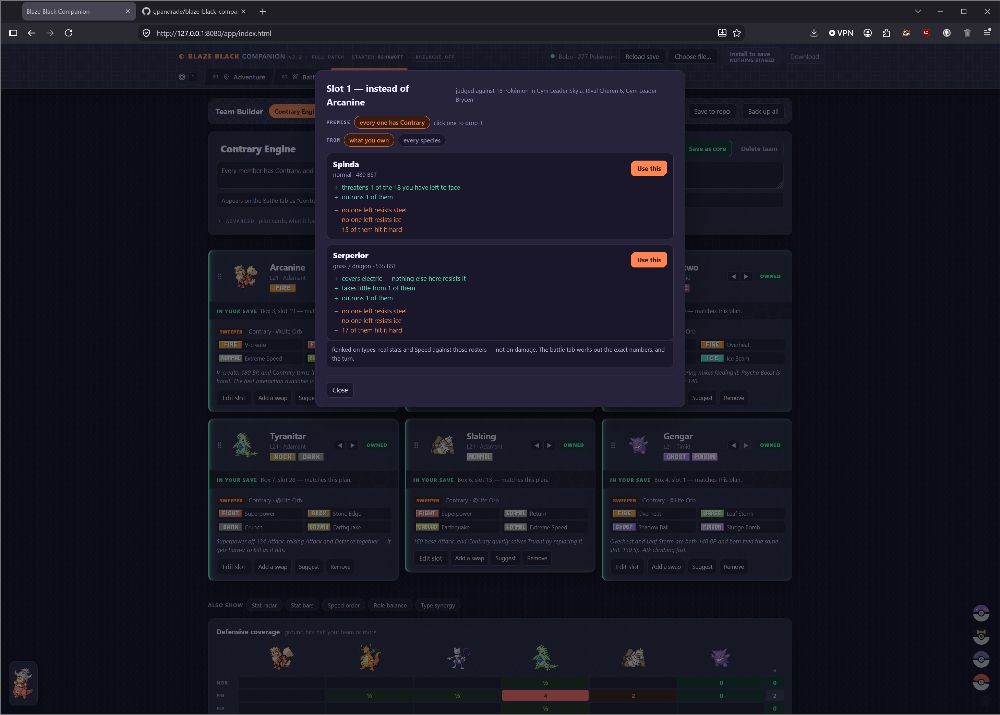
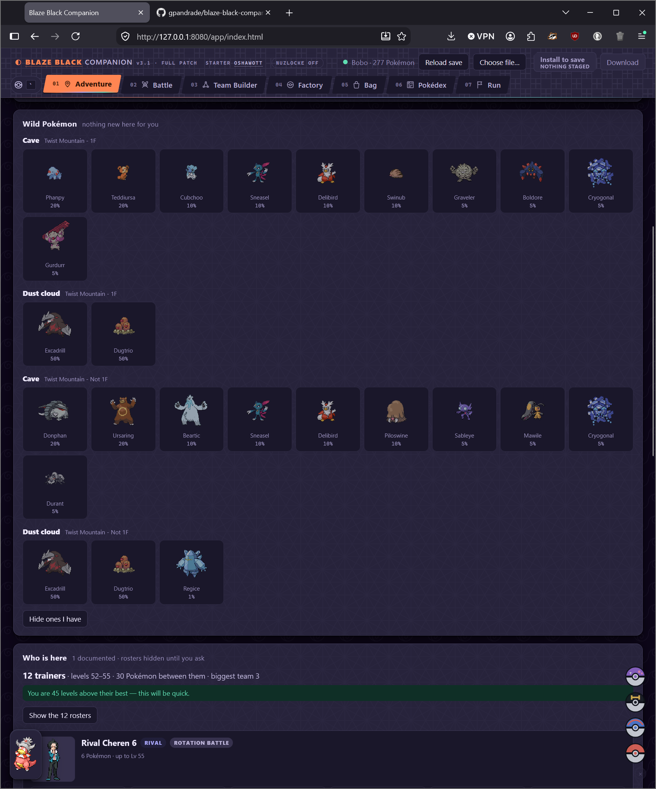
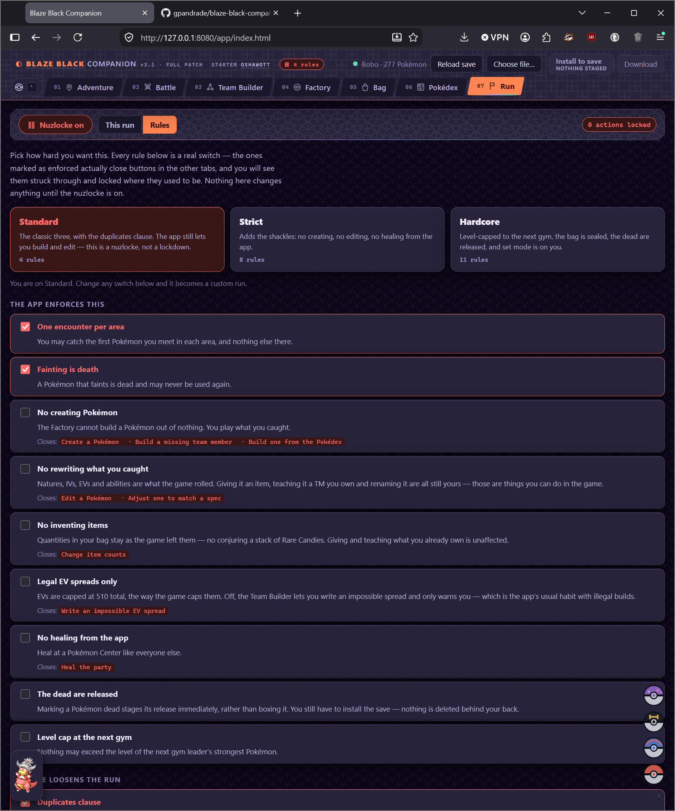
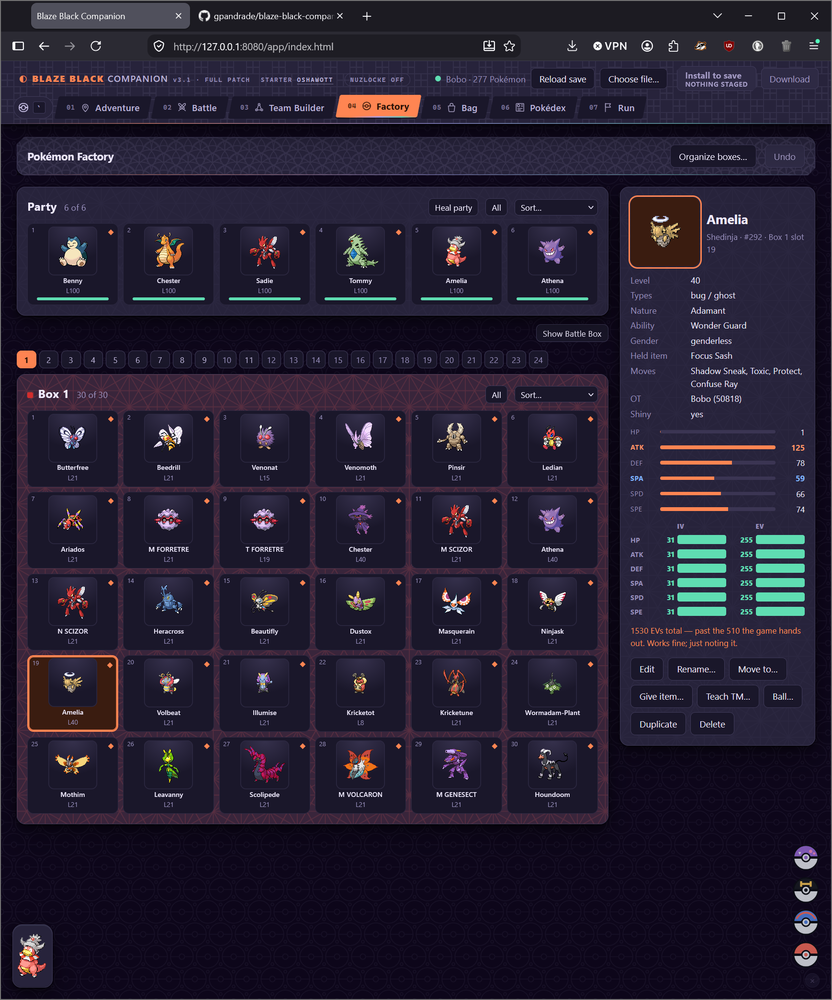
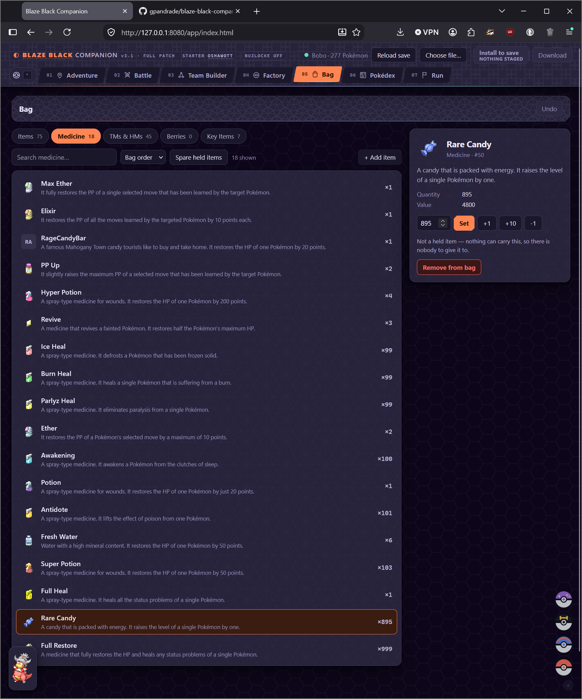
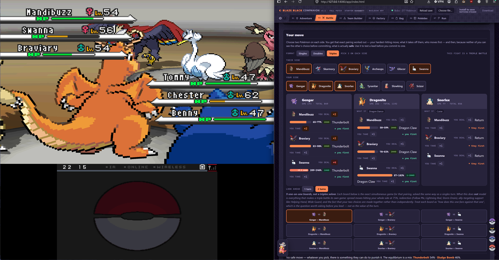

# Blaze Black companion

A local, offline companion for **Pokémon Blaze Black v3.1** — Drayano's ROM
hack of Pokémon Black — that reads your own save file and answers questions
about *your* game.

It exists because of one problem. The Full patch changed **487 abilities, 138
base-stat lines, 18 typings and 46 moves**. Every guide, wiki, damage
calculator and type chart on the internet is therefore confidently wrong about
this game, and wrong in ways that lose fights: Steel still resists Ghost and
Dark here, Fairy does not exist, Blizzard is 120 and not 110, trade evolutions
are gone. So nothing here is answered from memory.

### Where every number comes from

Not everything can come out of the cartridge, so the rule is a **strict
priority order** instead: a lower source is used only for what no higher source
can answer, and never to override one. Every mechanical number — the kind that
decides a fight — comes from the top two.

| | Source | What it answers |
|---|---|---|
| 1 | **Your ROM** | Base stats, both types, all three abilities, growth curves, base EXP, catch rates, egg groups, level-up learnsets, TM/HM compatibility, evolution methods. Move power, accuracy, PP, type, category, priority. Item names, descriptions and prices. Zones, trainer classes, and the portraits, party icons and badges decoded out of the cartridge's own graphics banks. |
| 2 | **Your save** | What you actually own, and where — levels, stats, natures, IVs, EVs, held items, bag, position, Pokédex. |
| 3 | **Drayano's docs** (`docs/`) | Story-fight rosters — gym leaders, Elite Four, N, rivals, with levels, items, natures and movesets — plus field-item locations and legendary encounter levels. His own writing about his own hack, and the ROM's tables do not encode any of it. |
| 4 | **The wiki** | Wild encounter tables, per-route trainer summaries, and the artwork: 649 Pokémon sprites, 443 item icons, 17 type icons. |

The wiki sits last for a reason, and it is worth knowing if you contribute:
it was generated from a **modern** Pokémon dataset, so it is contaminated
wherever the games changed after Gen 5. Its type-effectiveness tables use the
Gen 6 chart, 22 species are typed Fairy, and **63 moves carry the wrong
power** — 22% of every power cell. So it is used for two things it cannot be
wrong about (encounters and trainers are hack-authored, and a modern dataset
has nothing to say about them) and for pictures. Every mechanical value it
offers is ignored in favour of the ROM.

When sources genuinely conflict, the tool says so rather than quietly picking
one. Four evolutions where Drayano's docs and the ROM bytes disagree carry a
standing disclaimer in the Pokédex instead of an answer.

Nothing is uploaded. There is no account, no telemetry and no network call
after setup.

---

## What it looks like

[](screenshots/battle-matrix.png)

*Skyla's triple battle, two turns of look-ahead. Rows are what you could do,
columns are what they could do, and each cell is where the fight stands if you
both pick that — in whole Pokémon, so +100 means you come out one ahead. The
`worst` column is what each choice guarantees you, and the ringed row is the
one whose worst case is least bad. Here Dragon Claw has no punish and the turn
has a settled answer.*

<table>
<tr>
<td width="50%"><a href="screenshots/pokedex-farfetchd.png"></a></td>
<td width="50%"><a href="screenshots/team-builder-suggest.png"></a></td>
</tr>
<tr>
<td><b>The Pokédex, against both cartridges.</b> Farfetch'd is Normal/Flying
everywhere else and <b>Fighting/Flying</b> here, +123 BST, 60 Speed become 110,
Keen Eye and Inner Focus become Defiant and Super Luck. Every row is struck
through with what it used to be.</td>
<td><b>The Team Builder's slot suggester.</b> It infers what the team is
<i>for</i> — here, that every member has Contrary — and filters to that before
ranking, because there is no weight vector under which this team is optimal.
The premise is a chip you can drop.</td>
</tr>
<tr>
<td><a href="screenshots/adventure.png"></a></td>
<td><a href="screenshots/run-nuzlocke.png"></a></td>
</tr>
<tr>
<td><b>Adventure</b> knows where you are from the save. Encounters by method
and rate, what is worth farming, and who is waiting — with the fight's real
format, down to "rotation battle".</td>
<td><b>Nuzlocke mode is a set of switches, not a checklist.</b> Each rule names
the buttons it closes, and closed buttons stay on screen struck through rather
than vanishing — so you can see the constraint you chose.</td>
</tr>
<tr>
<td><a href="screenshots/factory.png"></a></td>
<td><a href="screenshots/bag.png"></a></td>
</tr>
<tr>
<td><b>The Factory</b> reads and writes: party, all 24 boxes, every field of a
record. It flags rather than blocks — that 1530 EV total is impossible in a
real game, and it says so and writes it anyway.</td>
<td><b>The Bag</b>, with the cartridge's own item text. Led by what is usable
now rather than a flat inventory.</td>
</tr>
</table>

<a href="screenshots/battle-beside-the-game.png"></a>

*Which is how it is actually used — beside the emulator, mid-fight.*

---

## What it does

Seven tabs, all reading the same save:

| Tab | What it answers |
|---|---|
| **Adventure** | Where you are, what is catchable here, what is worth farming, and what the region still holds |
| **Battle** | The fight you are about to have — real damage numbers both ways, the swap tree, and the turn solved as a matrix game |
| **Team Builder** | Plan a team, see the coverage holes, and get slot suggestions that respect what the team is *for* |
| **Factory** | Edit, create, move and heal Pokémon, then write the result back to the save |
| **Bag** | Your items, led by what is usable *now* — TMs your party can actually learn, stones for what you are carrying |
| **Run** | Nuzlocke mode: a rule picker where every rule is a real capability switch, plus run statistics |
| **Pokédex** | What the hack changed, per species — and a move-first search across every learnset |

Two things worth knowing about, because they are easy to miss:

- **The Pokédex search takes move names, not just species.** Type `Trick Room`
  and it lists everything that learns it, counting TMs as well as level-up —
  most of what you teach comes from a Machine.
- **The battle tab solves the turn as a two-player zero-sum game.** Your moves
  are rows, theirs are columns, and the value tells you what is safe against
  *everything* they can do rather than against a guess. It searches ahead, so
  it can price a switch — which a single-turn view structurally cannot, because
  a switch deals no damage and takes a hit. Maximin is also the right objective
  for a nuzlocke, where the downside is permanent.

The Pokédex works with no save loaded at all.

---

## What this repository does not contain

**No ROM. No save. No sprites. No game data of any kind.**

(The screenshots above are the one place any game art appears, and they are
pictures of this tool rather than anything extractable — no sprite file, table
or encounter list ships in this repository.)

That is deliberate and it is the reason setup has a step at all. The species
tables, move tables, item and map tables, trainer rosters, 649 sprites, 649
party icons, 95 trainer portraits and the region map are the game's own
content, and none of it is ours to redistribute. `./setup` extracts what it
needs from **your** copy, on **your** machine, into gitignored directories.

**One exception, named plainly:** `docs/` holds text conversions of **Drayano's
own documentation** — the readme files that come inside the v3.1 download. They
are included with thanks and with credit, because two features read them: the
story-fight list and the field-item locations, neither of which the ROM's own
tables encode. They are his writing, not ours; if he would rather they were not
here, they come out on request and `./setup` will fetch them from your own copy
of the download instead.

You need to bring:

- **Pokémon Blaze Black v3.1 (Full patch)**, as a `.nds` file — patched by you,
  from a Pokémon Black ROM you already own. Not distributed here, and please
  do not ask.
- An unmodified **Pokémon Black** ROM. Required, not optional: the extractor
  proves its field offsets against a known-good table before it writes
  anything, and refuses to emit tables it could not prove rather than risk
  shipping systematically mislabelled data. It is also what produces the
  hack-vs-vanilla diff the Pokédex shows as change badges. Read only, never
  modified.
- Your save file, if you want the parts that read a save.

The one committed test fixture, `tests/fixture.sav`, is a real save with the
trainer id and secret id replaced by fixed fake values. The two committed table
fixtures cover ten species and 73 moves — the contents of that fixture save,
and nothing else.

---

## Getting started

```bash
git clone <this repo>
cd blaze-black
./setup                      # clones the wiki, extracts your ROM's tables
./serve                      # http://127.0.0.1:8080/app/
```

`setup` will ask for your ROM if it cannot find one, and it is safe to re-run —
every step checks whether it is already done. Then copy the config:

```bash
cp companion.config.example.json companion.config.json
$EDITOR companion.config.json          # your save path, your ROM path
```

`companion.config.json` is gitignored, because a save path is personal. You can
also point at things with `BLAZE_SAVE`, `BLAZE_ROM` and `BLAZE_VANILLA_ROM`, or
drop a `.sav` onto the page — drag-and-drop always works and needs no config.

**Check what setup actually found before you trust anything on screen:**

```bash
cat companion.config.json
```

Setup searches your home directory, `/mnt/c/Users/*/Saved Games`,
`/mnt/c/Users/*/Downloads` and the current directory, and when several files
match it takes the **most recently modified** one and prints the alternatives
it passed over. That is usually right — a save is the file being written — but
if you keep old copies around, read the line. Pointing at a month-old backup
looks *exactly* like working: the app loads, every check passes, and the
trainer card shows a game you played in August. Override it with:

```bash
./setup --save "/path/to/pokemon_blaze_black.sav"
```

### Two rules about your emulator

Neither is optional, and the second one is how people lose work.

**1. Close your emulator before writing to the save.** An emulator keeps its
own copy of the cartridge RAM and rewrites the `.sav` when it exits, so an
install performed while it is open gets silently undone the moment you close
it. The server refuses to write while it detects one running.

**That detection assumes melonDS**, because it looks for a process with
"melon" in the name — the one emulator this has been used with. On DeSmuME,
mGBA or anything else the check finds nothing and *allows* the write, which
means **you are the check**. Close the emulator yourself. The rest of the
write path — backup first, validate, atomic replace, re-read, restore on
failure — does not depend on knowing which emulator you use.

**2. After an install, load with Continue — never a savestate.** A savestate is
a snapshot of the whole machine, including the cartridge RAM the `.sav` was
written from. Loading one restores that snapshot over your edit and then writes
it back out, so the change disappears and the file you carefully installed is
overwritten by the old state. This is not recoverable except from the backup.

Save in-game, exit to the title screen, and press **Continue**.

Reading is different and needs no ceremony: the app reads your `.sav` whenever
you press **Reload save**. Save in-game first, wait a couple of seconds for the
emulator to flush, then reload — the parser refuses a file written less than
two seconds ago, because it may still be a partial write.

### Useful commands

Everything you are likely to need, in one place.

| | |
|---|---|
| `./setup` | First run, and safe to re-run — every step checks whether it is done |
| `./setup --save PATH` | Point at a specific save when auto-detection picks wrong |
| `./setup --rom PATH --vanilla PATH` | Point at specific ROMs |
| `cat companion.config.json` | What it actually found — check this first when something looks stale |
| `./serve` | Run the app on http://127.0.0.1:8080/app/ (this blocks; use another terminal) |
| `./serve --port 9000` | Somewhere else |
| `./serve --no-write` | Read-only: disables the install endpoint entirely |
| `./test-all` | Every check in the repo. Needs `./setup` to have run |
| `python3 tests/test_parse_save.py` | Just the save parser — runs on a bare clone, names what it skipped |
| `python3 parse_save.py` | Dump your party and all 24 boxes to `state/party.json` |
| `python3 parse_bag.py` | Dump bag, position and Pokédex to `state/bag.json` |
| `python3 build_static.py` | Rebuild the app's data. Only needed if the ROM changes |
| `python3 build_sheet.py` | Build the standalone team sheet at `state/team_sheet.html` |

**When something looks wrong, in this order:**

1. **Ctrl+Shift+R.** A stale cache presents as "half the UI is broken" and is
   indistinguishable from a real bug. This has cost a whole day.
2. **`cat companion.config.json`** — are you looking at the save you think?
3. **Did you save in-game?** Savestates do not touch the `.sav`, so a game
   saved only to a savestate is invisible here.
4. **`./test-all`** — if this passes, the problem is display or configuration
   rather than data.

**Browser state is shared between installs.** Story progress, theme, tab order,
your nuzlocke rules and the "tour already seen" flag live in `localStorage`,
which the browser keys by *origin* — so every copy served from
`127.0.0.1:8080` shares them, no matter which directory it was served from.
To see a genuinely first-run experience, clear them in the DevTools console:

```js
Object.keys(localStorage)
  .filter(k => k.startsWith('bb_') || k.startsWith('blazeblack.'))
  .forEach(k => localStorage.removeItem(k));
location.reload();
```

### Why it wants a server

`./serve` binds `127.0.0.1` and exists for three reasons, none of which involve
sending anything anywhere: ES modules do not load over `file://`, `fetch()` of
the extracted tables is blocked there too, and it is the only way to answer
"just read the save at this path".

### Writing to your save

The app can write back — natures, EVs, whole teams. That path is guarded rather
than optional, because a corrupt save is unrecoverable:

1. it refuses while **melonDS is running**, since the emulator rewrites the
   `.sav` on exit and would silently clobber the install;
2. it validates the incoming bytes first — exact size, every block checksum,
   and the footer CRC over the checksum table;
3. it **backs up** your save and names the backup file in its reply;
4. it writes a temp file beside the target, re-validates it from disk, then
   atomically replaces;
5. it re-reads what landed and **restores the backup** if anything is wrong.

Run `./serve --no-write` to disable the endpoint entirely.

After an install, load your game with **Continue, not a savestate** — see
[Two rules about your emulator](#two-rules-about-your-emulator) above for why
that one matters more than it sounds.

---

## Requirements

**This is a command-line tool, and it needs a Unix-ish shell.** `./setup` and
`./serve` are a bash script and a Python script you run from a terminal — there
is no `.exe`, no installer, and nothing to double-click.

**Windows: use WSL.** `wsl --install` in PowerShell, reboot, and work inside
it. This is the only combination that has actually been run. Your ROMs and save
can stay on the Windows side; setup knows to look under `/mnt/c/Users/<you>/`.

**Linux and macOS should work, but neither has ever been tried.** Nothing here
is platform-specific on purpose — standard-library Python, bash, ES modules —
so it ought to just run. Expect to smooth over the odd small thing rather than
a port: a path guess that assumes `/mnt/c`, a BSD flag that differs from its
GNU spelling. If you hit one, an issue is genuinely useful, and the fix is
likely to be a line.

That is the whole difficulty curve. If you have patched a ROM and cloned a git
repo, nothing here is a step up from that — but it is a terminal, and it is
fair to know that before you start.

- Python 3.10+ (standard library only — no pip install, no dependencies)
- Node 18+ (for the test suite only; the app itself needs no build step)
- `git` (setup clones a wiki for encounter tables and sprites)
- A browser from this decade

The JavaScript is dependency-free ES modules. There is no bundler, no
`node_modules`, and no build.

### Tested on exactly one setup

This is one person's tool that got big enough to be worth sharing, and it has
only ever run on the machine it was written on:

- **Windows 11 + WSL2**, Ubuntu 26.04
- **Python 3.14**, **Node 24**
- **melonDS** as the emulator
- a **Blaze Black v3.1 Full patch** `.nds`, with an unmodified Pokémon Black
  beside it
- one desktop browser, at desktop window sizes

That list is what one machine happens to have, not a matrix anybody tested.
Nothing here is *meant* to be fussy — standard-library Python, ES modules, and
a `.sav` format that has not changed since 2010 — so a different distro,
emulator or browser will very likely be fine. "Very likely" is the honest word.
If you are the first to run this on macOS, or against a European ROM, or under
a different emulator, you are somewhere it has never been run.

The two places that would break first, if anything does: `./setup` shells out
to `find` and `curl` and guesses at Windows-side paths under `/mnt/c`, and
`./serve` detects a running emulator by calling `tasklist.exe`, which only
exists under WSL — elsewhere it silently decides no emulator is running, which
is the safe direction but not a check.

### Phones and tablets: untested, possibly fine

**There was no mobile pass and no responsive design work.** Nothing below
720px has been looked at on real hardware, and a couple of the dense surfaces —
the Factory's 30-slot box grid, the battle tab's matrix board — are wide by
nature and will need horizontal scrolling at best.

That said, it is probably closer to working than "no mobile pass" suggests,
because narrow-screen rules got written along the way whenever a layout
visibly broke on a resized desktop window. There are **21 `max-width`
breakpoints across nine files**, and the most common one is 620px — phone
width — with seven rules, plus three more at 560px. The shell carries a
viewport meta tag, and layout is flexbox and grid throughout (210 `display:
flex`, 55 `display: grid`).

What was *not* done is the part that makes that reliable. Sizing is
overwhelmingly in pixels rather than `rem` — 2,179 px values against 109 rem,
with six of the twelve stylesheets using no `rem` at all — so the interface
does not scale with a phone's larger default font, and there are 83 fixed
pixel widths that cannot reflow. None of it has been opened on real hardware.

So: the frame will probably hold and the contents may well overflow it. The
Pokédex and the published team sheet are the surfaces most likely to be usable
as-is; the Factory's box grid and the battle matrix are the least.

The friction is not really CSS anyway: `./serve` wants a filesystem path to
your `.sav`, and getting a save file onto a phone is the part nobody accepts.
The realistic mobile surfaces are the **published team sheet** (a standalone
HTML file you can host or open anywhere) and the **Pokédex tab**, which is the
only one that needs no save at all.

If you want it to work on a phone, that is a very reasonable thing to fix and
a good first contribution. It was left undone on purpose, not overlooked.

---

## Tests

```bash
./test-all
```

Around 1,500 assertions on a fresh clone and roughly 1,800 against a save with
full boxes — 297 in the save parser, the rest spread over the JS save layer and
seventeen per-feature verifiers. The count moves with your save because many
verifiers iterate what is actually in it. A fair number of them exist because a
plausible-looking change shipped a real regression, so they tend to assert the
*reason* for a behaviour rather than its shape. Several are mutation-tested:
the code is broken on purpose to check the test notices.

`./test-all` needs the ROM tables, so run `./setup` first — it checks up front
and says so plainly rather than half-running. Individual suites degrade on
their own: `python3 tests/test_parse_save.py` runs 233 of its 297 assertions on
a bare clone and names the five it had to skip.

The save layer is checked the strongest way available — a record built in
JavaScript must match the Python writer **byte for byte**, and the whole
524 288-byte file after write and reseal must hash identically.

---

## Layout

```
app/          the companion itself -- shell, tabs, styles
js/           client-side Gen 5 save read/write, zero dependencies
tools/        ROM decoders, generators, and one verifier per feature
tests/        the anonymised fixture and the Python test suite
notes/        why the code is shaped this way, and which bug shaped it
docs/         Drayano's own documentation (text conversions)
*.py          extractors, the save parser, the writer, the sheet builder
```

`sheet_template.html` is shared: `build_sheet.py` renders it to a standalone
page, and the Battle tab hosts the same file with data from your save, so the
damage maths exists once.

**`notes/` is worth reading before changing anything it covers.** Twelve files
of archaeology — the NCGR decoder, the matrix-game battle search, the contrast
rules, the nuzlocke's capability switches — each written the same way: here is
what looked right, here is why it was wrong, here is the test that now pins it.
Most of what looks arbitrary in this codebase is load-bearing, and these say
which bug made it so.

---

## Credits and licence

Pokémon Blaze Black is by **Drayano**, whose own documentation for the hack is
included under `docs/` with thanks — see above. Pokémon is Nintendo /
Creatures / GAME FREAK. This project is an unaffiliated fan tool, is not
endorsed by any of them, and ships none of their game content.

Wild encounter tables, per-route trainer summaries and all the artwork come
from the [blaze-black-wiki](https://github.com/AkeemAllen/blaze-black-wiki),
cloned at setup time rather than vendored — see the source table at the top
for what is and is not taken from it. The ROM decoding follows the field
mapping used by the Universal Pokémon Randomizer ZX.

The code is MIT licensed — see [LICENSE](LICENSE).
